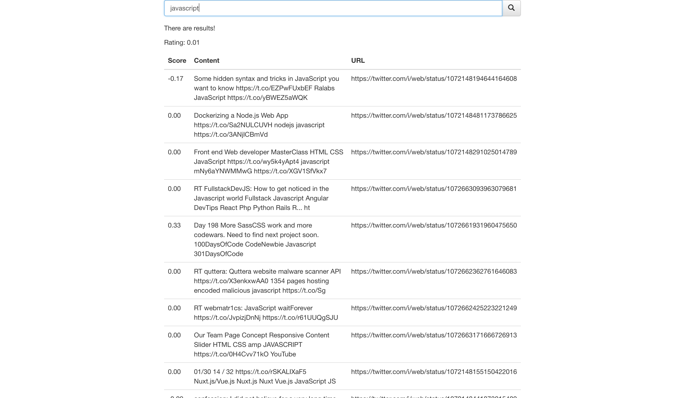

# MVP

A tool to show which open source projects hosted on GitHub are most popular, based on sentiment analysis of social media (Twitter, Reddit, etc).

Our MVP successfully accomplishes both of our primary use case goals, which are:

### "User – submit query and receive result"
The user can use the website to get a result for their query.
1. Submit query
1. Run query through the Elasticsearch engine
1. Match the query to posts in database
1. Display the result to the user in the right format

### "ML module: scrape for posts and populate the database"
Our system can use the Twitter API to get posts, and then assess the sentiment of them.
1. Run instances of the different scrapers
1. Determine the sentiment values of the scraped posts
1. Push resulting objects to the Elasticsearch database

## To improve
Things that we will improve in the future:
- A better data set
- A more accurate sentiment analyser
- A better UI
- Include a timestamp field
- Include a graph for historical sentiment
- Faster loading times
- Add other APIs

http://132.145.54.186:3000/
