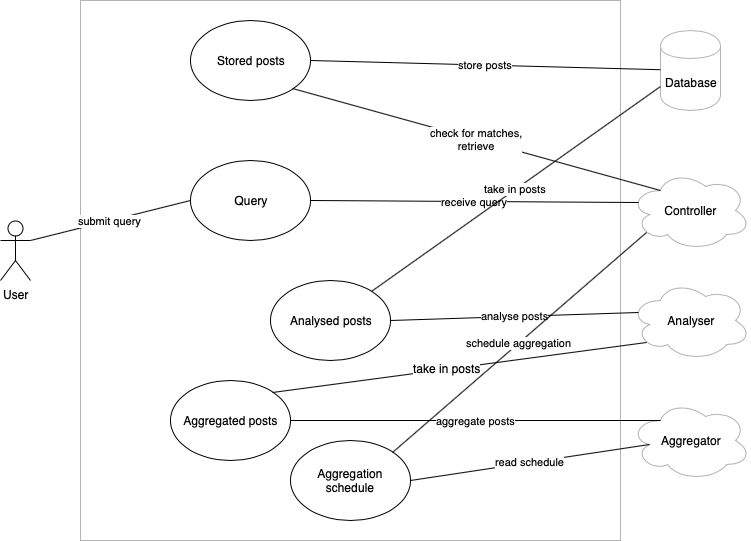
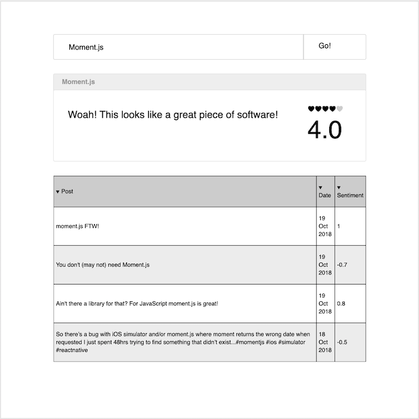
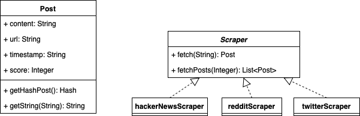

# Table of Contents
* [Overview](#overview)
* [Requirements](#requirements)
* [OO Design & UML](#oodesign)
* [Development Testing](#testing)

# Overview <a name="overview" />

In today's technology-driven world, social media sites such as Twitter and Reddit have become the most prominent platforms to express one's opinion and influence advertising on a global scale. According to Northeastern University (Boston, MA, USA), an estimated 80% of the world's data is unorganised, much of that is in the form of emails, social media, surveys etc. Sorting through this manually would be rigorous, expensive and impossibly tedious. Because of this a sentiment analysis on these applications have many businesses incorporating it into their processes to have a competitive edge and to gain valuable insights into certain topics that are otherwise unattainable.

Our client Ghyston is a bespoke software development company based in Bristol that uses a range of open source tools including languages, libraries and frameworks, for developing software. The problem they face is determining which pieces of software to use. One metric used when deciding is their popularity, since this tells them if other users experiences with the software were positive or negative. Sites such as GitHub have existing ratings which can be used to rank the most starred repositories, but this does not tell the whole story.

A solution to this problem would be a tool that looks for posts on social media about that particular piece of software and extracts a sentiment value from these. An aggregate sentiment of the posts would be extremely useful in social media monitoring as it allows us to gain a better synopsis of the wider public opinion behind certain topics in software and provide an open source project's real value in the eyes of the developer community and help our client in choosing which software to use in their projects.

# Requirements <a name="requirements" />

## System Stakeholders

### Internal Stakeholders
1.  **Client**: The software company Ghyston, represented by Mr Richard Meal.
2. **Software Development Team**: The team will be managing, testing, updating and developing this Open source software for our client. Team members:
  * Ben Price (Team Leader)
  * Navya Zaveri
  * Tharidu Jayaratne
  * Martin Noruisis
3. **Supporting Team**
  * **Resource Managers** at the University of Bristol. They will be providing us with funding and resources if necessary
  * **Our Mentor** Nuha Tumia, a third-year student. She will be helping us with any technical difficulties, throughout the development stage.
  * **Development Managers** Dr Daniel Schien and Dr Simon Lock. They will be supervising and teaching us the fundamentals of software development throughout the stages of development and testing.

### External Stakeholders
1. **Developers**: The developers of the open source software that we will be generating sentiment scores for
1. **End users**: The people who will be using our software, once it has been fully developed
  * **Consultants**: People who would use our software to provide expert advice professionally for advertising.
  * **Non-profit groups**: Organisations that could use our software to promote a particular social cause or promoting for a shared point of view, where no part of the organisation's income is distributed to its members, directors, or officers.
  * **The general public**: People who may be interested in finding the sentiment of a post.

## Use-case diagram

## Use-case goals
We have identified two sample use-case goals.

### "User – submit query and receive result" flow
1. Submit query
1. Run query through the Elasticsearch engine
1. Match the query to posts in database
1. Display the result to the user in the right format

### "ML module: scrape for posts and populate the database" flow
1. Run instances of the different scrapers
1. Determine the sentiment values of the scraped posts
1. Push resulting objects to the Elasticsearch database

### Alternative flow for "User: submit query and receive result"
1. Submit query
1. Run query through the Elasticsearch engine
1. No matches, perform fuzzy matching
1. Posts found, display the result to the user in the right format

### Exceptional flow for "User: submit query and receive result"
1. Submit query
1. Run query through the Elasticsearch engine
1. No matches, perform fuzzy matching
1. No matches
1. Display an error to the user

## Functional Requirements

1. The software will be able to extract insights from social media posts related to technology.
1. It must display an overall rating of a query given by the user.
1. It must display a list of up to 10 related posts for every successful query. If there are fewer than 10 posts, the front end will display all posts related to its respected query.
1. When a malformed query is provided *fuzzy matching* will take place.
1 The algorithm will find correspondences between segments of a text and entries in our database of previous translations.
1. Our REST API shall be *idempotent*.
  * Our algorithm can be applied multiple times without affecting the result beyond initial application.
1. The database will be updated at least once a week.
1. The development team will be responsible for maintaining and updating the system, with new posts.
1. The application uses the Elastic search engine to retrieve the closest match to a given query.

## Non-functional Requirements
### Performance
* The software shall be able to handle up to 36 requests per second
  * Rough estimate of requests per second (at peak times)
    * 4.7 million developers in Europe
    * Each making 20 requests
    * Let us assume they all access our website in the same 2 hour period
    * [(4.7M * 20 requests) / 365 days] / 2hr / 60min / 60sec = 36 requests per second

### Legislative
* The software shall be released under the MIT licence.

### Usability
* We will be aiming to make our software as usable as possible by testing on its:
  * **Success rate**: The accuracy of the algorithm will be tested using our questionnaire
  * **Efficiency**: This will be tested through the unit and system integration tests, to ensure our product delivers the result as fast as possible.
  * **Memorability**: When a user returns to the application after a period of not using it, the user shall remember enough to use it effectively the next time.
  * **User Interface**
      * We aim to make our user interface as user-friendly as possible by:
        * Keeping a minimalistic look so that everything will have a clear meaning.
        * Having an instantly noticeable search bar with a *Call-To-Action* search button.

  *We will be testing Usability by showing our product to a small sample of users and observing how they interact with it. Users will be asked for feedback via a questionnaire. Users will rate the usability on a scale 1-10. The average score shall be >7.*

#### User Interface Mock-ups

### Ethical
* To ensure that we are not biased against or towards particular pieces of software, we have to make sure that we are scraping posts expressing both negative and positive opinions for all queries.

# OO Design & UML <a name="oodesign" />

## Architecture

Relevant external systems our application depends on?

The overall structure of the application will be as follows:
1. **Front end**: receives input from the user, communicates with server via a Rest API to receive a result and outputs the result to the user
1. **Server**: stores a database of posts with pre-calculated sentiment values, handles requests from the front end, gets new posts from the ML module
1. **ML**: Natural Language Processing algorithm coupled with various web scrapers – procures new posts and assigns them with sentiment scores, sends them to the Server module for storage

## Static UML example

This is a sample of a class diagram for a class within our application. The Post class is an important one in our system as Post objects will form the basis for our Elasticsearch database. This diagram illustrates the structure of a Post object and its relationship with the scrapers.

## Dynamic UML example

This is a sample of a sequence diagram for the goal of getting the average sentiment for some query. This goal is the most important one in our application and the diagram visualises almost the entire working of the application. This diagram helped us to decide on the sequence and order of events that need to occur to accomplish the goal – getting a rating score for a given query.

# Development Testing <a name="testing" />

## Back end

### Server
With respect to the back end, we will use unit tests to ensure that the REST API is idempotent and that it returns JSON in the correct format. We will also use unit tests to make sure that new posts are hashed correctly, and that when new posts are added to our database they are not stored if that post already exists. We will have a unit test that attempts to add the same post to our database multiple times and check that the number of posts only increases by one.

We will use integration testing to verify that the components of our application interact with each other as expected. We will use a bottom-up approach, where we start with the lowest level module of our application and add components into our integration tests one-by-one until all components have been integrated. This means that if an integration test fails it will be easy to see which component has caused the failure.

### Sentiment Analysis
Given that Machine Learning is non-deterministic, we cannot write unit tests to test our model. As such, we have decided *not* to build our own model but to use a popular out-of-the-box sentiment analysis library and manually test it on a collection of random posts representative of our task. If it performs well enough on such posts, we use it as is. If it does not meet our expectations, we will either look at different libraries or tweak the parameters of the API model and determine what option best suits our needs.

## Front end
We will also use unit tests to ensure our front-end React.js components behave as intended. For instance, checking that clicking the 'search' button sends a query or checking that the results of a query are shown to the user in the correct format.

## Testing frameworks
The unit testing frameworks we will be using are *JUnit* for Java, *Mocha* for React.js and *unittest* for Python.
