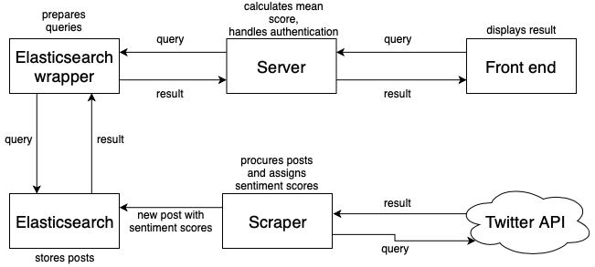
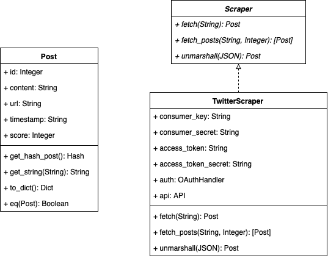
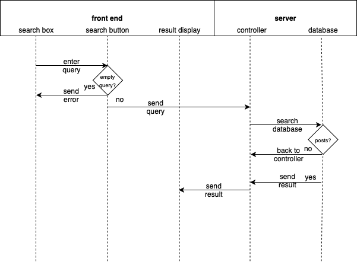

# OO Design & UML
## Architecture

The overall structure of the application will be as follows:
1. **Front end**: receives input from the user, communicates with server via a REST API to receive a result and outputs the result to the user
1. **Server**: calculates the mean score for a query and mostly acts as a passthrough between the front end and the Python module.
1. **Elasticsearch wrapper**: prepares queries to go to the Elasticsearch instance. Keeps an LRU cache for efficient working of the historical median values end point.
1. **Scraper**: Natural Language Processing algorithm coupled with a Twitter API wrapper – procures new posts and assigns them with sentiment scores, sends them to the Elasticsearch instance for storage
1. **Elasticsearch instance**: Stores posts together with calculated sentiment values

## Post and Scraper Class Diagrams (Static UML)

These are the class diagrams for the Post and Scraper classes within our application. The Post class is an important one in our system as Post objects will form the basis for our Elasticsearch database. This diagram illustrates the structure of a Post object and its relationship with the scrapers.

## Sequence Diagram (Dynamic UML)

This is a sequence diagram for the use-case goal of getting the average sentiment for some query. This goal is the most important one in our application and the diagram visualises almost the entire working of the application. This diagram helped us to decide on the sequence and order of events that need to occur to accomplish the goal – getting a rating score for a given query.
