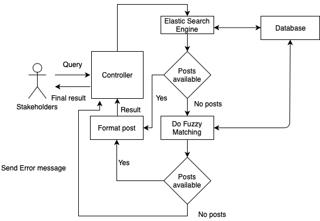

# Requirements

## System Stakeholders

### Internal Stakeholders
1.  **Client**: The software company Ghyston, represented by Mr Richard Meal.
1. **Software Development Team**: The team will be managing, testing, updating and developing this Open source software for our client. Team members:
  * Ben Price (Team Leader)
  * Navya Zaveri
  * Tharidu Jayaratne
  * Martin Noruisis
3. **Supporting Team**
  * **Resource Managers** at the University of Bristol. They will be providing us with funding and resources if necessary.
  * **Our Mentor** Nuha Tumia, a third-year student. She will be helping us with any technical difficulties throughout the development stage.
  * **Development Managers** Dr Daniel Schien and Dr Simon Lock. They will be supervising and teaching us the fundamentals of software development throughout the stages of development and testing.

### External Stakeholders
1. **Developers**: The developers of the open source software that we will be generating sentiment scores for.
1. **End users**: The people who will be using our software, once it has been fully developed.
1. **Consultants**: People who would use our software to provide expert advice professionally for advertising.
1. **Non-profit groups**: Organisations that could use our software to promote a particular social cause or promoting for a shared point of view, where no part of the organisation's income is distributed to its members, directors, or officers.
1. **The general public**: People who may be interested in finding the sentiment of a post.

-------

## Use case diagram

## Use case goals
We have identified two examples of use case goals.

### Sequence of Steps
1. User loads techsentiment.com
1. User enters a query
1. User searches for query
1. User is presented with an option to hide or show a graph containing sentiment scores of each post.
1. User is presented with a results box containing sentiment scores of posts related to the query together with their URLs and timestamps.
1. User interprets results and draws a conclusion about the prevailing sentiment towards the query.

### Alternative Pathways

#### User types in a malformed query
Steps 1 to 3 are completed. However, the query entered is malformed. The query is run through the Elasticsearch engine. If there are no matches, *fuzzy matching* is performed. If posts are found. Steps 4 to 6 will resume. 

### Exceptional Pathways

#### User types in an unrelated query regarding Open-source software
Steps 1 to 3 are completed. However, the query is not related to open source software. The query is run through the Elasticsearch engine. If there are no matches, fuzzy matching is performed. If no posts are found, An error message is displayed suggesting the user  to enter a different query.

### "ML module: scrape for posts and populate the database" flow
1. Run instances of the different scrapers
1. Determine the sentiment values of the scraped posts
1. Push resulting objects to the Elasticsearch database

---
# Atomic Requirements

## Functional Requirements

### Usage
1. The software will be able to extract the latest insights from social media posts related to technology.
1. The software will list related posts for every successful query.
1. The software will display an overall rating of a query given by the user.
1. The software will render a plot of historical sentiment values for each successful query.
1. The user will be able to hover over the graph and find sentiment scores for each point.
1. When a malformed query is provided, *fuzzy matching* will take place. The algorithm will find the posts with content that closely matches the original query.

### System
1. Our REST API shall be *idempotent*. Our algorithm can be applied multiple times without affecting the result beyond initial application.
1. The database will be updated at least once a week.
1. The development team will be responsible for maintaining and updating the system, with new posts.

### User Interface
1. The user should always be able to return to the previous screen.
1. An error message will be displayed if there are no posts related to the submitted query.
 

## Non-functional Requirements
### Performance
1. The software must be able to handle up to 36 requests per second
* Rough estimate of requests per second (at peak times)
    * 4.7 million developers in Europe
    * Each making 20 requests
    * Assume they all access our website in the same 2 hour period
    * [(4.7M * 20 requests) / 365 days] / 2hr / 60min / 60sec = 36 requests per second

2. The system must display the results within 10 seconds
3. The software must load the graph in less than 5 seconds

###  Accessibility
The software must be usable by a non-technical user.

### Legislative
The software shall be released under the MIT licence.

### Ethical
To ensure that we are not biased against or towards particular pieces of software, we have to make sure that we are collecting posts expressing both negative and positive opinions for all queries.

---

## Usability
We will be aiming to make our software as interactive and efficient as possible by testing on its:
* **Success rate**: The accuracy of the algorithm will be tested using our questionnaire.
* **Efficiency**: This will be tested through the unit andsystem integration tests, to ensure our product delivers theresult as fast as possible.
* **Memorability**: When a user returns to the applicationafter a period of not using it, the user shall rememberenough to use it effectively the next time.
* **User Interface**
  * We shall aim to make our user interface as user-friendly as possible by:
    * Keeping a minimalistic look so that everything will have a clear meaning.
    * Having an instantly noticeable search bar witha *Call-To-Action* search button.
* We will be testing the usefulness of our application byconducting a qualitative and quantitative study.

#### User Interface Mock-ups

